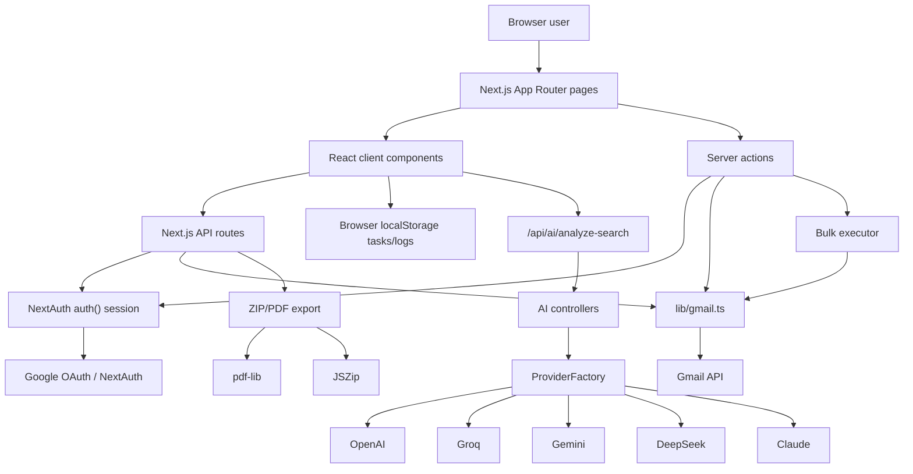

# Architecture Report

## Product Overview

EmailAir is a SaaS-style Gmail cleanup application. It helps a signed-in Google user inspect their inbox, search Gmail with structured filters, analyze matching emails with AI, export email data, and archive or move messages to Trash. Evidence: `app/page.tsx`, `app/dashboard/page.tsx`, `components/FilterBuilder.tsx`, `components/FilterPreview.tsx`, `components/AIAnalysisCard.tsx`, `lib/gmail.ts`, `lib/export.ts`.

Target users are Gmail users who want to reduce inbox clutter and make cleanup decisions with preview, analytics, and AI risk/summary context. Evidence: landing copy in `app/page.tsx`; dashboard analytics/search/manual cleanup UI in `app/dashboard/page.tsx`; AI analysis copy in `components/AIAnalysisCard.tsx`.

Core workflows:

- Connect Gmail with Google OAuth. Evidence: `components/LoginButton.tsx`, `lib/auth.ts`, `app/api/auth/[...nextauth]/route.ts`.
- View recent inbox emails and manually archive/delete selected messages. Evidence: `app/dashboard/page.tsx`, `components/EmailTable.tsx`, `lib/gmail.ts`.
- Build Gmail filters, preview matching emails, run AI analysis, then bulk archive/delete. Evidence: `components/FilterBuilder.tsx`, `components/FilterPreview.tsx`, `app/actions/filter-actions.ts`, `app/actions/execution-actions.ts`.
- View a full email, download attachments, and export one or more emails as ZIP/PDF. Evidence: `components/EmailViewer.tsx`, `components/AttachmentList.tsx`, `components/ExportSelectedButton.tsx`, `app/api/emails/[messageId]/route.ts`, `app/api/export/email/route.ts`, `app/api/export/selected/route.ts`, `lib/export.ts`.
- Review inbox analytics and cleanup candidates. Evidence: `lib/analytics.ts`, `components/AnalyticsOverview.tsx`, `components/TopSenders.tsx`, `components/AttachmentInsights.tsx`, `components/CleanupCandidates.tsx`.

Primary business features:

- Gmail OAuth connection with `gmail.modify` scope. Evidence: `lib/auth.ts`.
- Gmail inbox listing, search, archive, trash, message detail, attachment download. Evidence: `lib/gmail.ts`.
- AI search-result analysis, risk detection, and summaries. Evidence: `lib/ai/*`, `app/api/ai/analyze-search/route.ts`, `components/AIAnalysisCard.tsx`.
- Bulk archive/delete executor with batching and retry. Evidence: `lib/executor/*`, `app/actions/execution-actions.ts`.
- Email export to ZIP with generated PDF and attachments. Evidence: `lib/export.ts`, `app/api/export/*`.
- Browser-local saved task scaffolding. Evidence: `lib/tasks/*`, `components/SaveTaskButton.tsx`. Active route integration is not proven from repository.
- Billing: Not proven from repository.

## Architecture Inventory

| Concern | Finding | Evidence |
|---|---|---|
| Frontend framework | Next.js App Router with React 19 and TypeScript | `package.json`, `app/layout.tsx`, `app/dashboard/page.tsx` |
| Backend framework | Next.js route handlers and server actions | `app/api/**/route.ts`, `app/actions/*.ts` |
| Database | No database implementation proven. Persistent server database usage is not present. | no DB dependency in `package.json`; no app usage found for Prisma/Drizzle/Supabase/etc. |
| Authentication provider | NextAuth v5 beta with Google provider | `package.json`, `lib/auth.ts`, `app/api/auth/[...nextauth]/route.ts` |
| State management | React component state, server actions, React `cache`, browser `localStorage` for tasks/logs | `components/*.tsx`, `lib/analytics.ts`, `lib/tasks/task-storage.ts`, `components/TaskPreviewCard.tsx` |
| External services | Gmail API, Google OAuth, AI provider HTTP APIs | `lib/gmail.ts`, `lib/auth.ts`, `lib/ai/providers/*.ts` |
| AI integrations | OpenAI, Groq/Grok, Gemini, DeepSeek, Claude provider classes | `lib/ai/provider-factory.ts`, `lib/ai/providers/*.ts` |
| Email providers | Gmail only | `googleapis` dependency in `package.json`; `lib/gmail.ts` |
| Search infrastructure | Gmail search query API; no independent search index | `lib/gmail.ts` `searchEmails()` |
| Queue/background jobs | Not proven from repository. Execution is synchronous in server actions/API calls. | `app/actions/execution-actions.ts`, `lib/executor/executor.ts` |
| Billing | Not proven from repository. | no Stripe/billing dependency or route found |

## High-Level Architecture

## Security and Access Boundaries

- Dashboard route protection happens in `app/dashboard/layout.tsx` and `app/dashboard/page.tsx` using `auth()`.
- Gmail-backed APIs require `session.accessToken`. Evidence: `app/api/emails/[messageId]/route.ts`, `app/api/emails/[messageId]/attachments/[attachmentId]/route.ts`, `app/api/export/email/route.ts`, `app/api/export/selected/route.ts`.
- AI diagnostic and analysis APIs do not call `auth()` in source. Evidence: `app/api/ai/analyze-search/route.ts`, `app/api/ai/test-analyze/route.ts`, `app/api/ai/debug/route.ts`.

