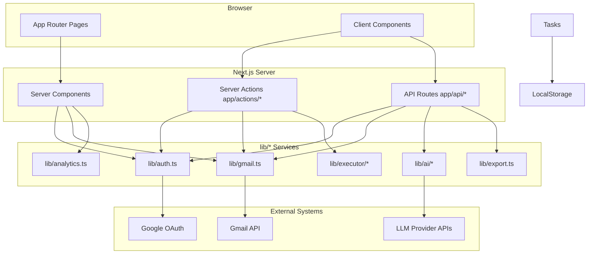

# System Architecture

**Product:** Gmail Hygiene (`package.json` name: `gmail-hygiene`)  
**Evidence date:** Repository snapshot analyzed from all tracked source files and git history.

---

## Product Purpose

A Next.js web application that helps users clean up their Gmail inbox by:

- Authenticating with Google OAuth and obtaining a Gmail API access token (`lib/auth.ts`)
- Listing, searching, viewing, archiving, and deleting emails via Gmail API (`lib/gmail.ts`)
- Showing heuristic inbox analytics (`lib/analytics.ts`)
- Running AI analysis on email metadata/snippets (`lib/ai/*`, `app/api/ai/analyze-search/route.ts`)
- Exporting emails to ZIP (PDF + attachments) (`lib/export.ts`, `app/api/export/*`)

**Source:** `app/layout.tsx` metadata, `PROJECT_CONTEXT.md`, implementation in `lib/gmail.ts`.

---

## High-Level Architecture

There is **no separate backend service** and **no database**. All server logic runs inside the Next.js application process.



---

## Frontend Architecture

| Aspect | Implementation | Evidence |
|--------|----------------|----------|
| Framework | Next.js 15 App Router | `package.json`, `app/` directory |
| Rendering | Mix of Server Components and Client Components | `"use client"` in `components/*.tsx`; async server pages in `app/dashboard/page.tsx` |
| Styling | Tailwind CSS 3 | `tailwind.config.ts`, `app/globals.css` |
| State | React `useState`, `useTransition`, `useEffect`, `useMemo` | `components/FilterBuilder.tsx`, `components/EmailTable.tsx`, `components/FilterPreview.tsx` |
| Navigation | `next/navigation` (`redirect`, `useRouter`) | `app/page.tsx`, `app/dashboard/layout.tsx`, `components/EmailTable.tsx` |
| Data fetching (client) | `fetch()` to API routes | `components/AIAnalysisCard.tsx`, `components/EmailViewer.tsx` |
| Data fetching (server) | Direct `lib/*` calls in Server Components / Server Actions | `app/dashboard/page.tsx`, `app/actions/filter-actions.ts` |

### Page structure

| Route | Type | File |
|-------|------|------|
| `/` | Server | `app/page.tsx` |
| `/dashboard` | Server | `app/dashboard/page.tsx` |
| `/ai-playground` | Client | `app/ai-playground/page.tsx` |
| `/test-ai` | Client | `app/test-ai/page.tsx` |

### Auth boundary

`app/dashboard/layout.tsx` calls `auth()` and redirects unauthenticated users to `/`. This protects the entire `/dashboard` subtree.

---

## Backend Architecture

“Backend” is co-located with the frontend in Next.js:

| Mechanism | Location | Purpose |
|-----------|----------|---------|
| Server Actions | `app/actions/filter-actions.ts`, `app/actions/execution-actions.ts` | Gmail filter preview/mutations; bulk executor entry |
| API Route Handlers | `app/api/**/route.ts` | REST-style endpoints for AI, emails, export, auth |
| Service modules | `lib/*.ts` | Gmail, analytics, AI, export, executor |

**Runtime:** Email and export routes set `export const runtime = "nodejs"` (`app/api/emails/[messageId]/route.ts`, export routes). AI playground calls `lib/ai` directly on server from client page — **UNKNOWN** whether those calls execute on server or client without tracing Next.js bundling; `app/ai-playground/page.tsx` is `"use client"` and imports `@/lib/ai` which may bundle server-only code — **potential architectural concern, not verified at runtime**.

---

## Database Architecture

**NONE.** No ORM, SQL, or document database dependencies in `package.json`. No `prisma`, `mongoose`, `drizzle`, or similar in repository (grep across repo).

### Persistent data stores in use

| Store | What | Evidence |
|-------|------|----------|
| Gmail (external) | Source of truth for emails | `lib/gmail.ts` |
| In-memory `Map` (process) | AI controller cache, rate limits; analyze-search route cache | `lib/ai/controllers/*.ts`, `app/api/ai/analyze-search/route.ts` |
| NextAuth session/JWT | User identity + `accessToken` | `lib/auth.ts`, `types/next-auth.d.ts` |

---

## Authentication Architecture

| Component | Role | File |
|-----------|------|------|
| NextAuth v5 beta | Session management | `lib/auth.ts`, `package.json` |
| Google provider | OAuth sign-in | `lib/auth.ts` |
| Scopes | `openid`, `email`, `profile`, `gmail.modify` | `lib/auth.ts` `authorization.params.scope` |
| Token storage | `access_token` on JWT → `session.accessToken` | `lib/auth.ts` callbacks |
| Auth API | `GET`/`POST` handlers | `app/api/auth/[...nextauth]/route.ts` |
| Route protection | Dashboard layout | `app/dashboard/layout.tsx` |
| Per-request auth | `auth()` in server actions and most API routes | `app/actions/*`, `app/api/emails/*`, `app/api/export/*` |

**Gap (evidence):** `app/api/ai/analyze-search/route.ts`, `app/api/ai/test-analyze/route.ts`, and `app/api/ai/debug/route.ts` do **not** call `auth()` in source.

---

## Queue / Worker Architecture

**NONE.** No job queue (Bull, BullMQ, SQS, etc.), no background workers, no cron jobs in repository.

Bulk operations run **synchronously** in the request lifecycle via `lib/executor/executor.ts` (batching + retry within the same HTTP/server-action call).

---

## External Integrations

| Integration | Purpose | Entry points |
|-------------|---------|--------------|
| Google OAuth | User authentication | `lib/auth.ts`, `LoginButton.tsx` |
| Gmail API (`googleapis`) | Email CRUD/read | `lib/gmail.ts` |
| LLM providers (OpenAI, Grok, Gemini, DeepSeek, Claude) | AI analysis | `lib/ai/provider-factory.ts`, `lib/ai/providers/*` |

See `docs/api-reference.md` and architecture diagrams in `docs/system-flows.md`.

---

## Deployment Architecture

| Item | Status | Evidence |
|------|--------|----------|
| Hosting platform | **UNKNOWN** (not configured in repo) | No `vercel.json`, `Dockerfile`, or CI workflows in git tracked files |
| Next.js config | Empty default config | `next.config.ts` exports `{}` |
| Vercel hint | `.vercel` in `.gitignore` | `.gitignore` line 32–33 |
| Environment | `.env.example`, `.env.local.example` | Root examples for OAuth and AI keys |
| Build | `next build` | `package.json` scripts |

**Inference (not verified):** Typical deployment is a Node.js host running `next start` after `next build`, with env vars from `.env.example`. Mark as **UNKNOWN** until deployment docs or CI exist.

---

## Layer Responsibilities

### Application / UI (`app/`, `components/`)

Renders UX, collects user input, triggers server actions or `fetch` to API routes.

### Actions (`app/actions/`)

Authenticated server-side mutations and filter preview.

### API (`app/api/`)

JSON/binary HTTP endpoints for client components and testing.

### Domain services (`lib/`)

| Module | Responsibility |
|--------|----------------|
| `gmail.ts` | Gmail API wrapper |
| `analytics.ts` | Inbox statistics and cleanup heuristics |
| `ai/` | LLM abstraction (controllers + providers) |
| `executor/` | Batch archive/delete with retry |
| `export.ts` | ZIP/PDF generation |

### Types (`types/`)

Shared TypeScript contracts.

---

## AI System Architecture (summary)

Detailed in `PHASE_8_ARCHITECTURE.md` and implemented in code:

```
Application → lib/ai/index.ts (facade)
           → controllers (cache, rate limit, validate)
           → ProviderFactory → BaseProvider.complete(prompt)
           → External LLM HTTP APIs
```

Provider selection: `process.env.AI_PROVIDER` (`lib/ai/provider-factory.ts`).

Public API surface: `parseIntent`, `analyzeEmails`, `detectRisk`, `summarizeEmails` (`lib/ai/index.ts`).

---

## Executor Architecture (summary)

```
executeBulkAction (server action)
  → executeAction (lib/executor/executor.ts)
    → createBatches (default size 5)
    → retry per batch
    → executorHandlers[action] (lib/executor/handlers.ts)
      → archiveEmails / deleteEmails (lib/gmail.ts)
```

Download handler throws deferred error (`lib/executor/handlers.ts`).

---

## Critical Architectural Constraints

1. **Single-tenant per session:** All Gmail access uses the authenticated user's `session.accessToken`.
2. **No multi-user server state:** Tasks in localStorage; AI cache in process memory.
3. **Two archive/delete paths:** Direct Gmail calls from dashboard inline actions vs executor from filter preview (`app/dashboard/page.tsx` vs `components/FilterPreview.tsx`).
4. **Filter preview is the integration hub** for AI, bulk executor, export, and email viewer — not the dashboard root page.

---

## Related Documents

- `docs/repository-map.md`
- `docs/feature-inventory.md`
- `docs/system-flows.md`
- `docs/database.md`
- `docs/api-reference.md`
- `docs/technical-debt.md`
- `docs/project-status.md`
