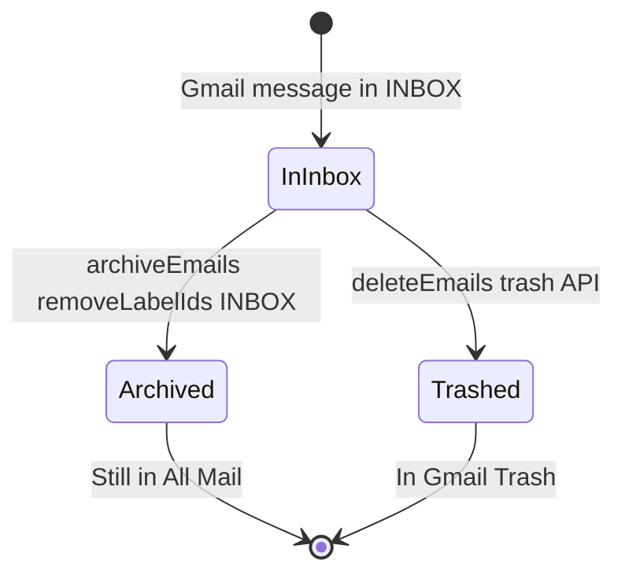
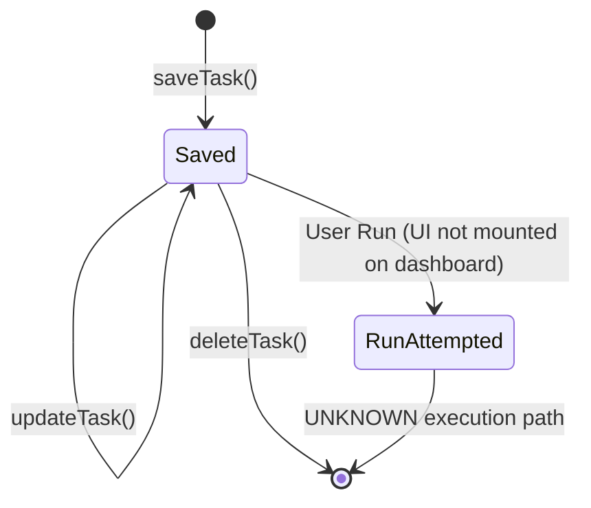

# Database Analysis

## Summary

**The application does not use a relational, document, or embedded database.**

Evidence:

- `package.json` dependencies: `next`, `next-auth`, `googleapis`, `jszip`, `pdf-lib`, `react` — no database client libraries.
- Repository-wide grep for `prisma`, `mongoose`, `postgres`, `mysql`, `sqlite`, `drizzle`, `supabase`: no application usage (only `queue-microtask` npm transitive dep and Redis **TODO comments** in AI controllers).

Therefore: **no tables, relationships, constraints, or ORM migrations exist.**

---

## Data Persistence Model

All persistence falls into the categories below.

### 1. Gmail (External System of Record)

| Aspect | Detail |
|--------|--------|
| **Ownership** | End user's Google account |
| **Access** | OAuth `access_token` on session (`lib/auth.ts`, `types/next-auth.d.ts`) |
| **Operations** | List, search, read, modify labels, trash (`lib/gmail.ts`) |
| **Lifecycle** | Emails live in Gmail; app does not store copies server-side |

**Entities (logical, not DB tables):**

| Entity | Fields (app usage) | Source |
|--------|-------------------|--------|
| Message | `id`, headers, `snippet`, `labelIds`, payload | Gmail API |
| Attachment | `attachmentId`, `filename`, `mimeType`, `size` | `lib/gmail.ts` `collectEmailParts` |

---

### 2. NextAuth Session / JWT

| Aspect | Detail |
|--------|--------|
| **Storage** | **UNKNOWN** — default NextAuth session strategy not explicitly set in `lib/auth.ts` (no `session: { strategy: "jwt" }` visible, but JWT callback is defined) |
| **Custom fields** | `accessToken` on JWT and Session |
| **Lifecycle** | Expires per NextAuth/Google token lifetime; 401 handling in UI messages |

---

### 3. Browser `localStorage` (Tasks)

| Field | Value |
|-------|-------|
| **Key** | `email-cleaner-tasks` (`lib/tasks/task-types.ts` `TASK_STORAGE_KEY`) |
| **Format** | JSON array of `Task` objects |
| **Schema** | `lib/tasks/task-types.ts` |

```typescript
// Evidence: lib/tasks/task-types.ts
type Task = {
  id: string;
  name: string;
  query: string;      // Gmail search string (stored as opaque query text)
  action: "delete" | "archive" | "download";
  createdAt: string;
  updatedAt: string;
};
```

| Aspect | Detail |
|--------|--------|
| **Ownership** | Per browser, per origin |
| **Validation** | `lib/tasks/task-validator.ts` on write |
| **Lifecycle** | Created/updated/deleted via `lib/tasks/task-storage.ts`; survives page reload; not synced across devices |

**Relationships:** None (flat list).

**Constraints (application-level):**

- Validated by `validateTaskInput` in `lib/tasks/task-validator.ts` — **exact rules: see that file** (not fully duplicated here; file exists in repo).

---

### 4. In-Memory Process State (Server)

| Store | Location | TTL | Purpose |
|-------|----------|-----|---------|
| `analyzeCache` | `app/api/ai/analyze-search/route.ts` | 1 hour (`CACHE_TTL_MS`) | Dedupe AI responses by email hash |
| `analysisCache`, `rateLimitMap` | `lib/ai/controllers/analysis-controller.ts` | 1 hour / 1 min window | Per-controller cache and rate limit |
| Similar maps | `risk-controller.ts`, `summary-controller.ts`, `intent-controller.ts` | Same pattern | Same |

| Aspect | Detail |
|--------|--------|
| **Ownership** | Single Node.js process |
| **Lifecycle** | Lost on restart/deploy; not shared across instances |
| **Planned replacement** | Comments `// TODO: Redis Later` in controllers (`PHASE_8_ARCHITECTURE.md`) |

---

### 5. React `cache()` (Request Deduplication)

| Function | File |
|----------|------|
| `getEmailAnalytics` | `lib/analytics.ts` |

This deduplicates within a single React render pass / request, not durable storage.

---

## Data Ownership Matrix

| Data type | Owner | Durability |
|-----------|-------|------------|
| Email content | Google (Gmail) | Permanent (user mailbox) |
| OAuth token | Google + session cookie/JWT | Session-bound |
| Saved tasks | User browser | Until cleared |
| AI cache | Server RAM | Ephemeral |
| Export ZIP | Generated on demand | Transient (download) |

---

## Lifecycle Diagrams

### Email mutation lifecycle



Evidence: `lib/gmail.ts` `archiveEmails`, `deleteEmails`.

### Task lifecycle (localStorage)



---

## Comparison to Traditional Database Concerns

| DB concern | This project |
|------------|--------------|
| Tables | N/A |
| Foreign keys | N/A |
| Migrations | N/A |
| Transactions | N/A (Gmail API calls are independent per message in `Promise.all`) |
| Multi-tenant isolation | Session token scopes all Gmail access to one user |

---

## UNKNOWN Items

- NextAuth database adapter usage (if any) — not configured in visible `lib/auth.ts`
- Production session storage (JWT vs database sessions)
- Whether hosting platform provides external session store

---

## Related Documents

- `docs/architecture.md` — persistence overview
- `docs/feature-inventory.md` — features using each store
- `docs/technical-debt.md` — cache/scalability debt
