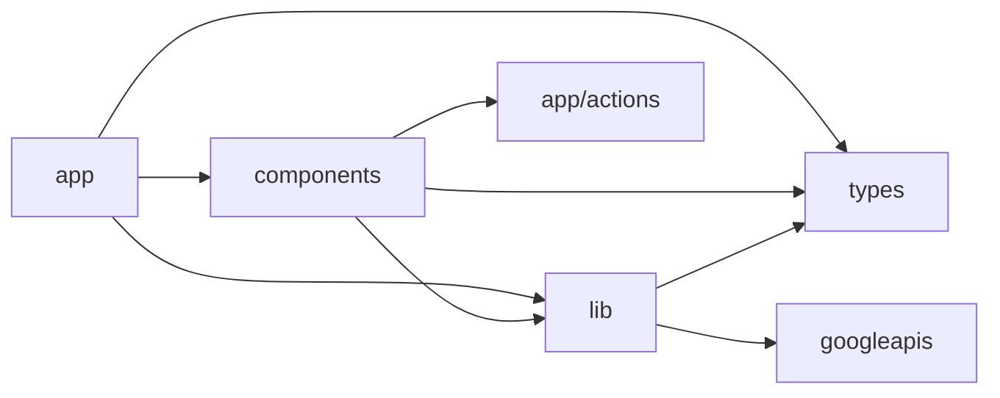

# Repository Map

**Repository:** `emailair` (folder: `emailair`)  
**Total tracked TS/TSX application files:** ~93 (per glob); **git tracked files:** 101 entries including docs and config.

---

## Root-Level Files

| File / folder | Purpose | Dependencies / relationships |
|---------------|---------|------------------------------|
| `package.json` | Dependencies and scripts (`dev`, `build`, `type-check`) | Defines Next.js 15, NextAuth 5 beta, googleapis, AI-related runtime via fetch in providers |
| `package-lock.json` | Lockfile | — |
| `tsconfig.json` | TypeScript config, `@/*` path alias | Used by all TS/TSX |
| `next.config.ts` | Next.js config (empty object) | `app/` |
| `next-env.d.ts` | Next.js types | — |
| `tailwind.config.ts` | Tailwind | `app/globals.css` |
| `postcss.config.mjs` | PostCSS | Tailwind |
| `.env.example` | Env template (OAuth, AI) | Documents required secrets |
| `.env.local.example` | Local env template | — |
| `.gitignore` | Ignores `node_modules`, `.env*`, `.vercel` | — |
| `PROJECT_CONTEXT.md` | Prior analysis doc (untracked in initial git status; may exist locally) | Reference only |
| `UI_ARCHITECTURE.md` | UI composition notes | Reference; partially superseded by code (AI in FilterPreview) |
| `PHASE_8_ARCHITECTURE.md` | AI layer design doc | Matches `lib/ai/*` |
| `PHASE_8_1_ARCHITECTURE_AUDIT.md` | AI audit notes | Reference |
| `PHASE_8_4_CONTEXT.txt`, `PHASE_8_4_REAL_INTEGRATION.txt` | Task integration plans | Reference for Phase 8.3/8.4 |
| `IMPLEMENTATIONS_REFERENCE.txt` | Implementation notes | Reference |
| `tests/phase-8-2-api-tests.js` | Manual API tests for AI | `app/api/ai/*` |

---

## `app/` — Next.js App Router

**Purpose:** Routes, layouts, server actions colocated under actions folder, API route handlers.

**Depends on:** `lib/*`, `components/*`, `types/*`

### `app/page.tsx`

- Landing + login; redirects authenticated users to `/dashboard`
- Uses `components/LoginButton.tsx`, `lib/auth.ts`

### `app/layout.tsx`

- Root HTML shell, metadata, `globals.css`

### `app/dashboard/`

| File | Purpose |
|------|---------|
| `layout.tsx` | Auth guard (`session.user`) |
| `page.tsx` | Main dashboard: analytics, FilterBuilder, EmailTable |

**Relationship:** Central production UX for the dashboard workspace.

### `app/actions/`

| File | Purpose |
|------|---------|
| `filter-actions.ts` | `previewFilterAction`, `archiveFilterAction`, `deleteFilterAction` |
| `execution-actions.ts` | `executeBulkAction` → executor |

### `app/api/`

| Path | Purpose |
|------|---------|
| `auth/[...nextauth]/route.ts` | NextAuth handlers export |
| `ai/analyze-search/route.ts` | Combined AI analysis endpoint |
| `ai/test-analyze/route.ts` | Debug analyze endpoint |
| `ai/debug/route.ts` | Provider env debug |
| `emails/[messageId]/route.ts` | Email details JSON |
| `emails/.../attachments/.../route.ts` | Attachment binary download |
| `export/email/route.ts` | Single email ZIP |
| `export/selected/route.ts` | Multi email ZIP |

### `app/ai-playground/page.tsx`

- Client UI testing `lib/ai` controllers directly

### `app/test-ai/page.tsx`

- Client UI testing AI HTTP endpoints

### `app/error.tsx`, `app/not-found.tsx`

- Standard Next.js error boundaries

---

## `components/` — React UI

**Purpose:** Presentational and container client components.

**Depends on:** `types/*`, `lib/ai` (types), `app/actions/execution-actions`, API routes via `fetch`

### Dashboard / inbox

| Component | Role |
|-----------|------|
| `AnalyticsOverview.tsx` | Overview stats cards |
| `TopSenders.tsx` | Sender leaderboard |
| `AttachmentInsights.tsx` | Attachment metrics |
| `CleanupCandidates.tsx` | Heuristic inbox opportunity suggestions |
| `FilterBuilder.tsx` | Filter form + preview trigger |
| `FilterPreview.tsx` | **Major hub:** selection, AI, executor, export, viewer |
| `EmailTable.tsx` | Recent inbox table + archive/delete |
| `LoginButton.tsx`, `LogoutButton.tsx` | Auth UI |

### AI

| Component | Role |
|-----------|------|
| `AIAnalysisCard.tsx` | Auto-fetch `/api/ai/analyze-search` |
| `AIActionCard.tsx` | Post-analysis action recommendations |
| `AIRiskBadge.tsx`, `AIEmailBreakdown.tsx`, `AIWarningsList.tsx` | AI result display |

### Execution UX

| Component | Role |
|-----------|------|
| `ExecutionConfirmationModal.tsx` | Pre-mutation confirm |
| `ExecutionResultModal.tsx` | Post-execution results / retry |

### Email detail / export

| Component | Role |
|-----------|------|
| `EmailViewer.tsx` | Modal viewer |
| `AttachmentList.tsx` | Attachment download links |
| `ExportSelectedButton.tsx` | Bulk ZIP export |

## `lib/` — Server/domain logic

**Purpose:** Business logic callable from Server Components, Server Actions, and API routes.

### `lib/auth.ts`

NextAuth configuration; exports `handlers`, `auth`, `signIn`, `signOut`.

### `lib/gmail.ts`

Gmail API: `getRecentEmails`, `searchEmails`, `archiveEmails`, `deleteEmails`, `getEmailDetails`, `getAttachment`, `getGmailClient`.

### `lib/analytics.ts`

`getEmailAnalytics` (React `cache`), heuristic helpers.

### `lib/export.ts`

PDF generation (`pdf-lib`), ZIP (`jszip`), size limits.

### `lib/ai/`

| Path | Role |
|------|------|
| `index.ts` | Public facade |
| `provider-factory.ts` | Provider selection |
| `base-provider.ts` | Abstract LLM client |
| `providers/*.ts` | Provider HTTP implementations |
| `controllers/*.ts` | Cache, rate limit, prompt, validate |
| `prompts.ts` | JSON-only prompt templates |
| `controller-utils.ts` | `extractJsonFromText`, validators |

### `lib/executor/`

| Path | Role |
|------|------|
| `executor.ts` | Batch orchestration |
| `handlers.ts` | archive/delete/download handlers |
| `batch.ts`, `retry.ts`, `progress.ts` | Utilities |
| `types.ts` | Executor types |
| `index.ts` | Re-exports |
| `__tests__/executor.test.ts` | Vitest tests |

## `types/` — Shared TypeScript types

| File | Contents |
|------|----------|
| `email.ts` | `Email`, `EmailDetails`, `EmailActionResult` |
| `filter.ts` | `EmailFilter` |
| `analytics.ts` | Analytics result shapes |
| `ai.ts` | AI request/response types |
| `ai-response.ts` | Additional AI response types |
| `next-auth.d.ts` | Session/JWT `accessToken` augmentation |

---

## `tests/`

| File | Role |
|------|------|
| `phase-8-2-api-tests.js` | Node script for AI API testing |
| `lib/executor/__tests__/executor.test.ts` | Unit tests (Vitest in devDependencies) |

---

## Folder Dependency Graph

**Note:** `components/FilterPreview.tsx` imports `app/actions/execution-actions` — allowed Next.js pattern for client → server action.

---

## Important Cross-Folder Relationships

1. **`app/dashboard/page.tsx`** orchestrates analytics + filter + inbox; passes server actions to `FilterBuilder` and inline actions to `EmailTable`.
2. **`FilterBuilder` → `FilterPreview`** is where AI + executor + export + viewer live.
3. **`lib/ai`** is consumed by API routes and the AI playground.

---

## Files to Read First (onboarding)

Listed in `PROJECT_CONTEXT.md` § Critical Files — still accurate, with addition:

- `components/FilterPreview.tsx` — true integration point for Phase 8–9 features
