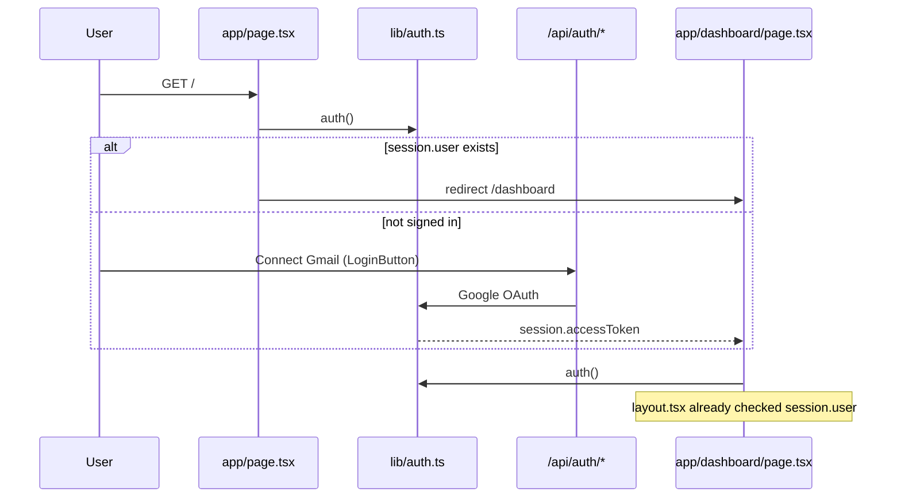
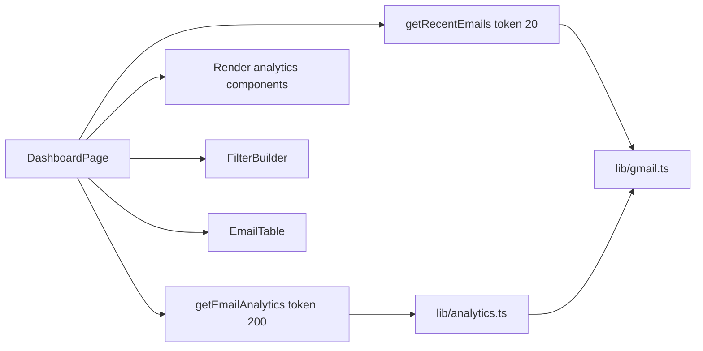
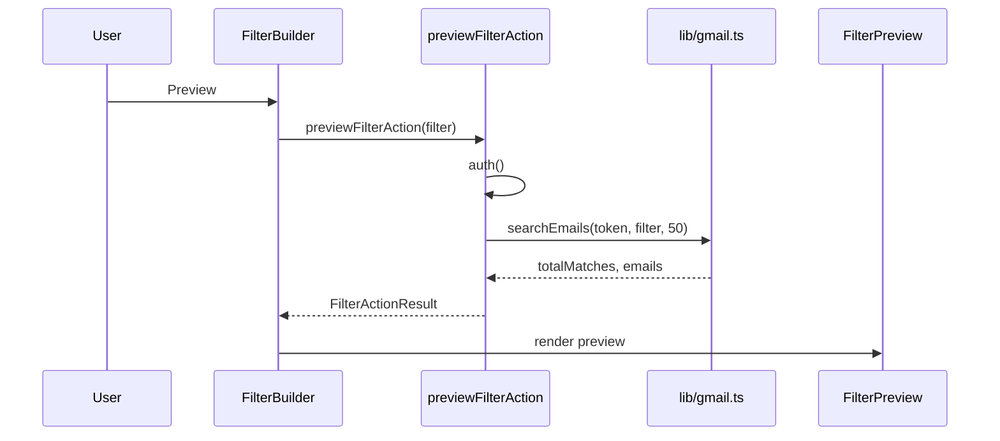
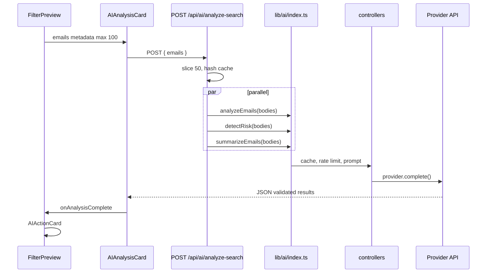
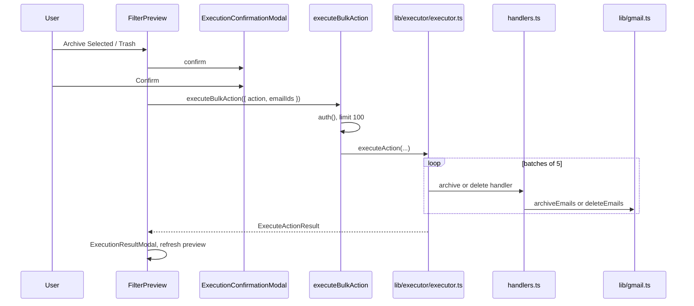
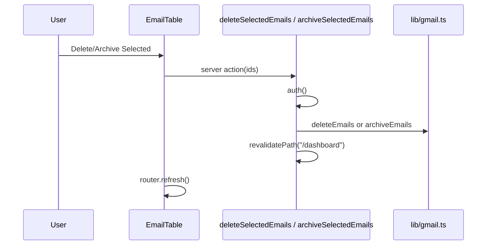
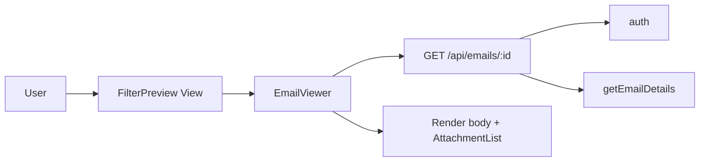
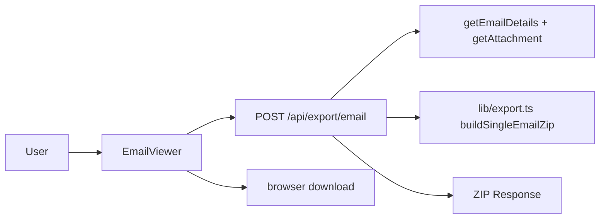
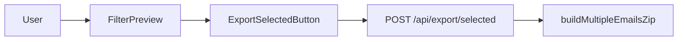
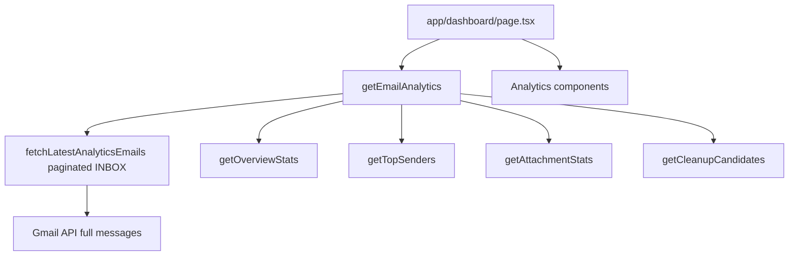

# System Flows

End-to-end flows with file references. No database layer exists in any flow.

---

## Flow 1: Authentication & Dashboard Entry



| Step | Component / file |
|------|------------------|
| Landing | `app/page.tsx` |
| Sign in | `components/LoginButton.tsx` → `signIn("google")` |
| OAuth config | `lib/auth.ts` |
| Handler | `app/api/auth/[...nextauth]/route.ts` |
| Guard | `app/dashboard/layout.tsx` |
| Dashboard load | `app/dashboard/page.tsx` |

---

## Flow 2: Load Dashboard Data (Server)



| Data | Function | File |
|------|----------|------|
| Recent emails | `getRecentEmails` | `lib/gmail.ts` |
| Analytics | `getEmailAnalytics` (cached) | `lib/analytics.ts` |

---

## Flow 3: Filter Preview (Search)



**Files:** `components/FilterBuilder.tsx`, `app/actions/filter-actions.ts`, `lib/gmail.ts`, `components/FilterPreview.tsx`

---

## Flow 4: AI Analysis (Filter Preview)



| Layer | File |
|-------|------|
| UI trigger | `components/AIAnalysisCard.tsx` (`useEffect` on signature) |
| API | `app/api/ai/analyze-search/route.ts` |
| Facade | `lib/ai/index.ts` |
| Controllers | `lib/ai/controllers/analysis-controller.ts`, `risk-controller.ts`, `summary-controller.ts` |
| Provider | `lib/ai/provider-factory.ts` → `lib/ai/providers/*.ts` |

**Auth:** API route does not call `auth()` — **UNKNOWN** if middleware protects it (no `middleware.ts` in repo).

---

## Flow 5: Bulk Archive/Delete (Filter Preview → Executor)



**Files:** `components/FilterPreview.tsx`, `app/actions/execution-actions.ts`, `lib/executor/executor.ts`, `lib/executor/handlers.ts`, `lib/gmail.ts`

---

## Flow 6: Recent Inbox Archive/Delete (Dashboard Table)



**Files:** `components/EmailTable.tsx`, `app/dashboard/page.tsx` (inline `"use server"` functions)

**Difference from Flow 5:** No executor, no confirmation modal, no batch retry.

---

## Flow 7: Email Viewer



**Files:** `components/FilterPreview.tsx`, `components/EmailViewer.tsx`, `app/api/emails/[messageId]/route.ts`

---

## Flow 8: Export Single Email



---

## Flow 9: Export Selected Emails



---

## Flow 10: Analytics Computation



Heuristics: promotions, LinkedIn, unread age, large attachments — `lib/analytics.ts`.

---

## Flow 11: AI Playground (Dev)

```
User → app/ai-playground/page.tsx
     → import { parseIntent, analyzeEmails, ... } from @/lib/ai
     → controllers → provider → LLM
```

No API route; direct library invocation from client component.

---

## Flow Summary Table

| # | Workflow | Mutation? | Auth check |
|---|----------|-----------|------------|
| 1 | Login | No | OAuth |
| 2 | Dashboard load | No | layout + page token check |
| 3 | Filter preview | No | Server action |
| 4 | AI analysis | No | **None on API route** |
| 5 | Bulk archive/delete (preview) | Yes | Server action |
| 6 | Inbox archive/delete | Yes | Inline server action |
| 7 | View email | No | API route |
| 8–9 | Export | No | API route |
| 10 | Analytics | No | Server page |
| 11 | Tasks | **Not wired** | N/A |
